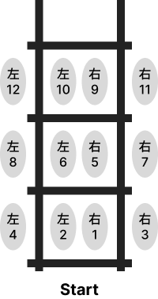
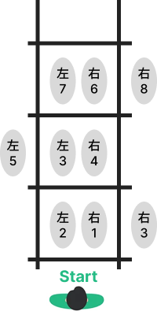
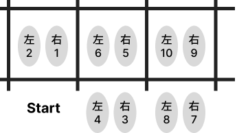
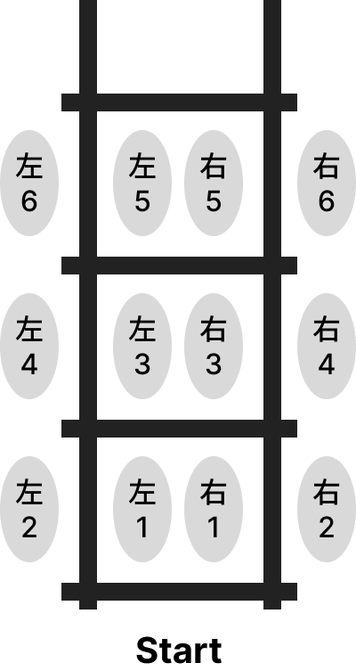

近期在對練的時候，深感腳步移動練習的重要性，乾脆自己畫個圖，整理一下繩梯的基礎練習，給未來想隨時想練習的自己。

以下練習方式主要是參考 ICE 的拳擊教室的摘要筆記。如果想直接看教學影片請[點此跳轉到影片](#video-section)。

###

### 1\. 進進出出（4步）

* **動作：** 每一格都要踩四步。例如右腳先進、左腳跟進，接著右腳踏出格、左腳跟出格。

---

### 2\. 進進出（3步）

* **動作：** 每一格踩三步。
* **順序：** 先一腳踏入格內，另一腳跟進，接著第一隻腳踏出格，循環往復。
* **重點：** 保持輕快的節奏感

---

### 3\. 進進出（橫向3步）

* **動作：** 身體橫向對著繩梯，腳步是前進和斜後方的位移。
* **目的：** 訓練腳步在不同角度切換時的穩定性。

---

### 4\. 跳躍進出（雙腳跳）

* **動作：** 類似第一種練習，但改為「跳躍」的方式。
* **細節：** 雙腳同時跳進格內，再雙腳同時跳出。
* **重點：** 腳跟要拉起來，身體要蹲一下保持彈性，這個動作比較累。

---

### 💡 重要提醒

* **腳跟離地：** 練習全程要踮起腳尖，腳跟保持懸空，這樣移動才會快
* **重心下沉：** 重心在上半身會讓身體飄飄的，重心要穩穩地沉下去
* **搭配出拳：** 當你腳步熟練後，嘗試讓雙手跟著腳步節奏一起出拳
* **建議量：** 每個動作練習 **3 分鐘**（一個回合），中間休息 1 分鐘，整套做完約 20 分鐘

---

### 教學影片 \{#video-section\}

{{&lt; youtube VmGM-UHhZvE &gt;}}