要用 Kindle 買書除了在 Amazon 之外，我通常會去 Google Play 買，因為有的書價錢比較便宜。

但這時候就會遇到平台不共用的問題，接下來會告訴大家怎麼把在 Google Play 上面買的書裝到 Kindle 裡閱讀。

# Step 1: 先確認 Google Play 上你要買的書，是否有「文字重排」的功能
在你要買的書的頁面往下滑，點擊「關於本電子書」

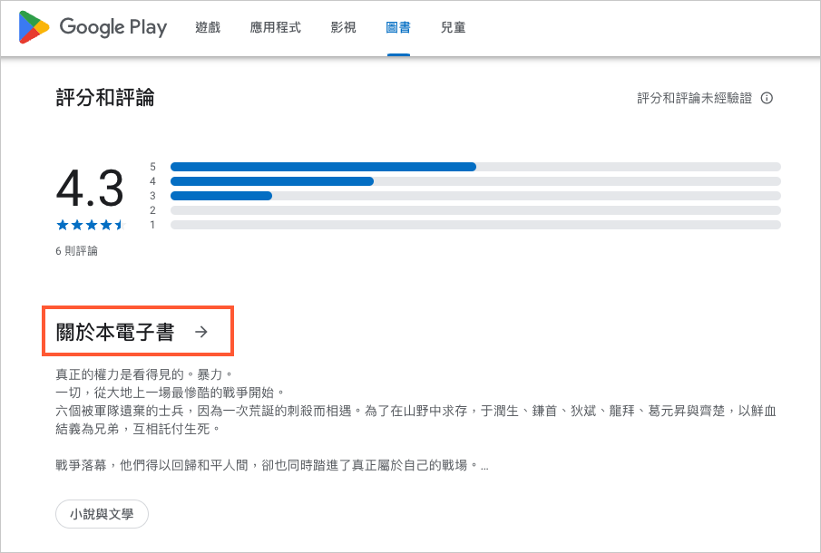

首先要確認功能下方，有顯示「**文字重排**」才可以使用以下的方法，沒問題的話，就可以接下一個步驟。（顯示「文字重排」代表是 ePub 檔案）

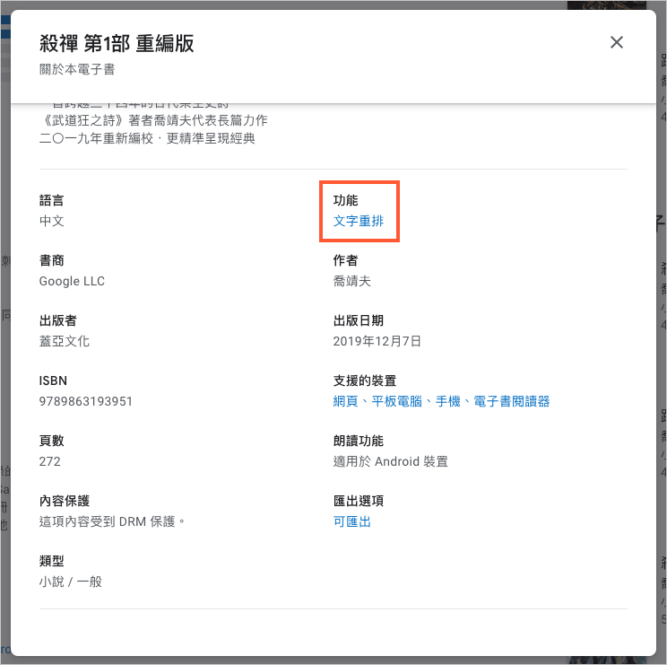

購買完書籍以後，點擊書籍右下方三個點，選「**匯出**」

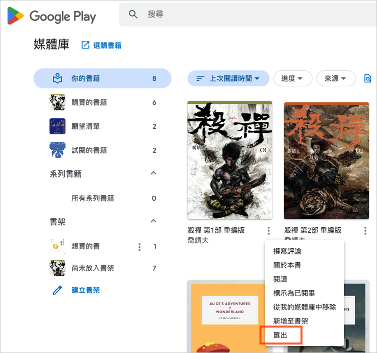

點擊「**匯出 EPUB 的 ACSM 檔案**」

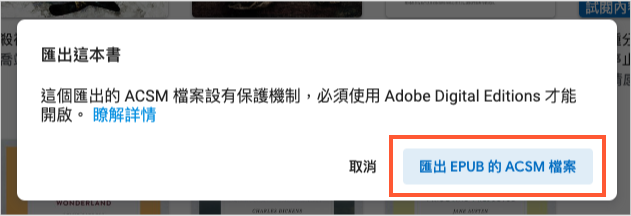

這時會看到自己剛剛匯出的檔案在 Downloads 資料夾裡面

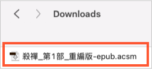

# Step 2: 將 ACSM 檔案轉為 ePub 檔案：Adobe Digital Editions
可以看到剛下載的檔案副檔名是 .acsm，接下來我們要把 .acsm 轉成 .epub，這時就要靠 Adobe Digital Editions 這套軟體

[下載 Adobe Digital Editions](https://www.adobe.com/tw/solutions/ebook/digital-editions/download.html)

選擇 Macintosh 版本下載

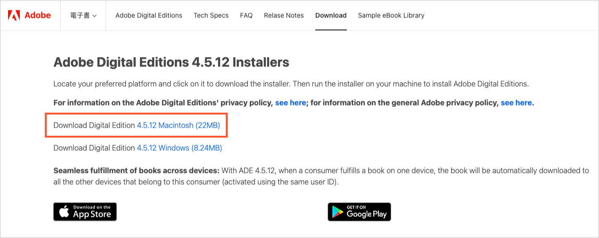

打開 Adobe Digital Editions 以後，選取你要轉檔的書按右鍵，點擊「Show File in Finder」

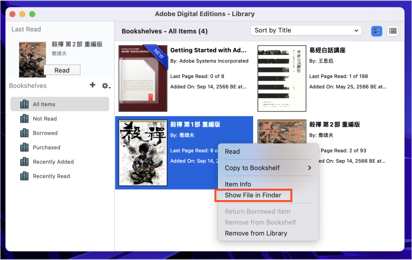

Finder 裏面的自動產出 .epub 檔案，代表轉檔成功

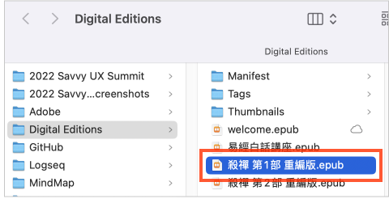

# Step 3: 解除電子書 DRM 保護：Calibre

現在要使用 Calibre 來幫電子書解除 DRM 保護，先來把 Calibre 下載好

[下載 Clibre](https://calibre-ebook.com/download)

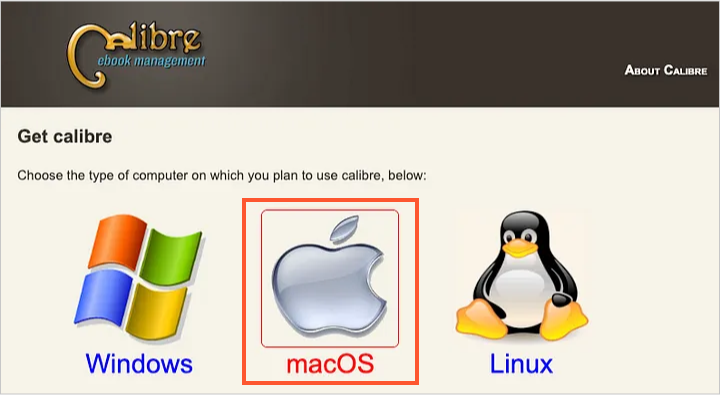

下載好 Clibre 以後，我們要先去下載 DeDRM 這個外掛來破解 DRM 保護

[下載 DeDRM_tools_10.0.9.zip](https://github.com/noDRM/DeDRM_tools/releases) (選擇最新版，目前是 v10.0.9)

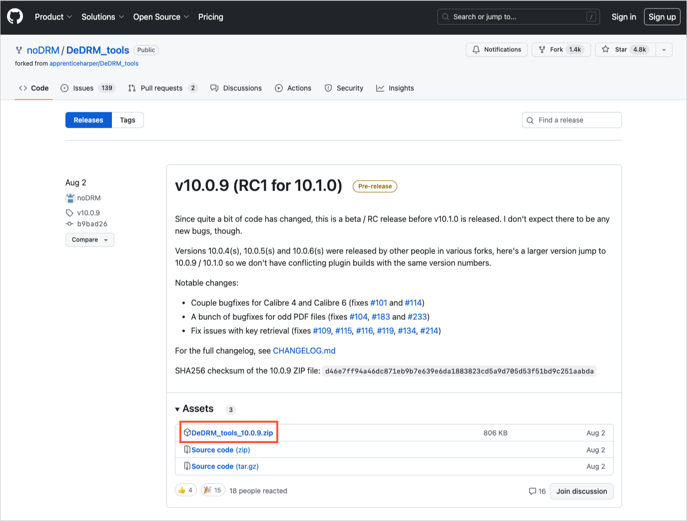

DeDRM_tool_10.0.9.zip 解壓縮以後會看到一個檔案叫 DeDRM_plugin.zip

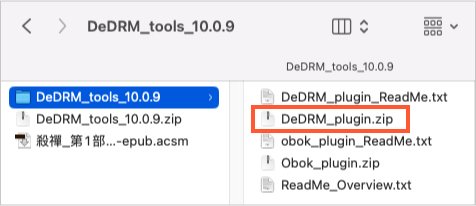

這時在 Calibre 的偏好設定裡，點擊「外掛」

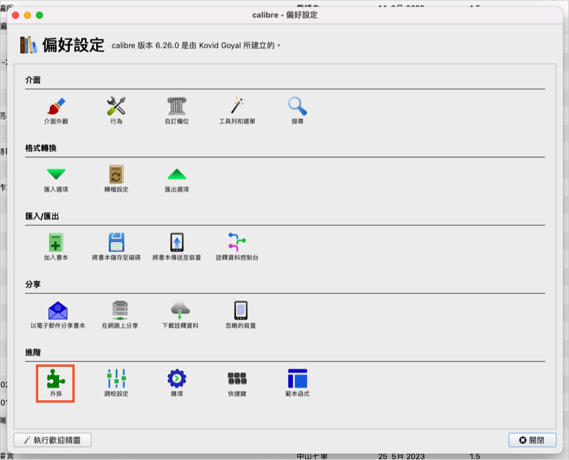

點擊「從檔案載入外掛」

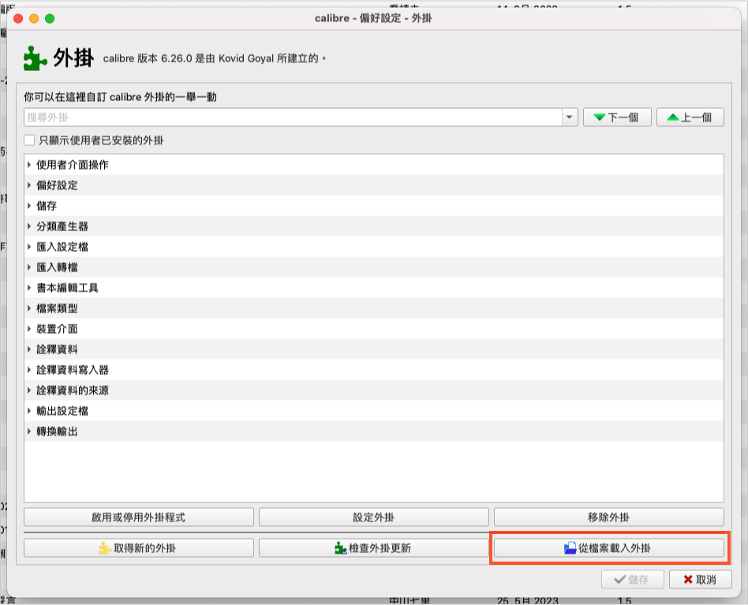

選取 DeDRM_plugin.zip

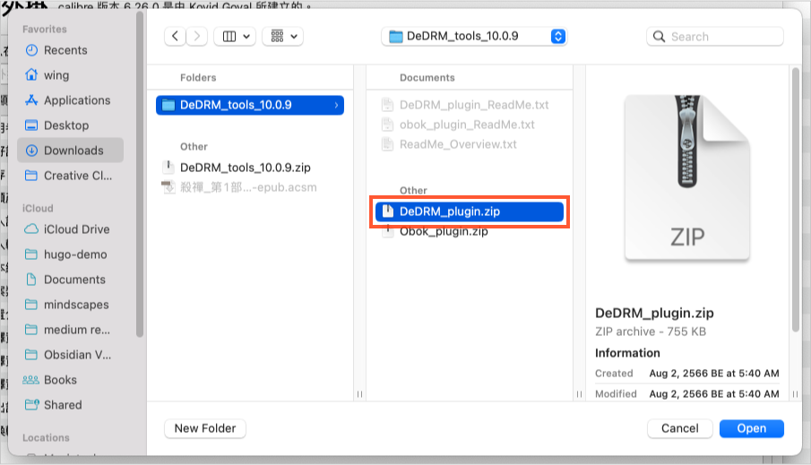

成功安裝外掛以後就可以重新啟動 Calibre 了

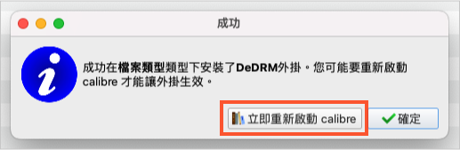

這時你到 Calibre 偏好設定 / 外掛 / 檔案類型裏面就可以看到剛剛成功安裝的 DeDRM(10.0.9)

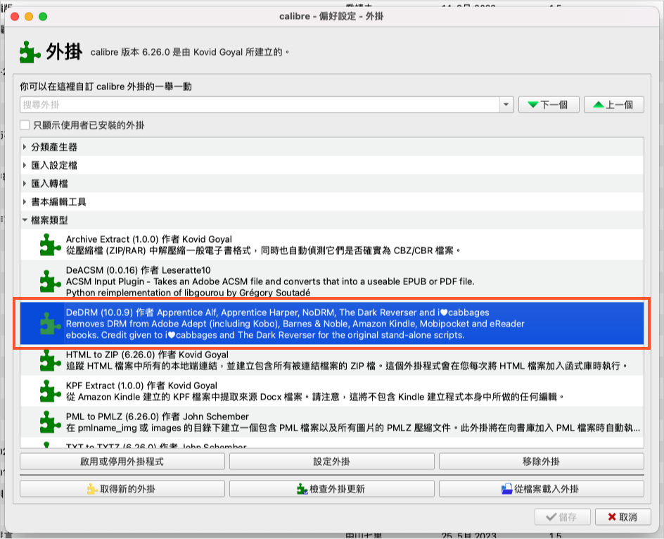

現在到 Calibre 點擊左上角的「加入書本」，把剛剛已經轉成 .epub 的檔案打開，這時外掛就會自動幫你破解書本的 DRM 保護。

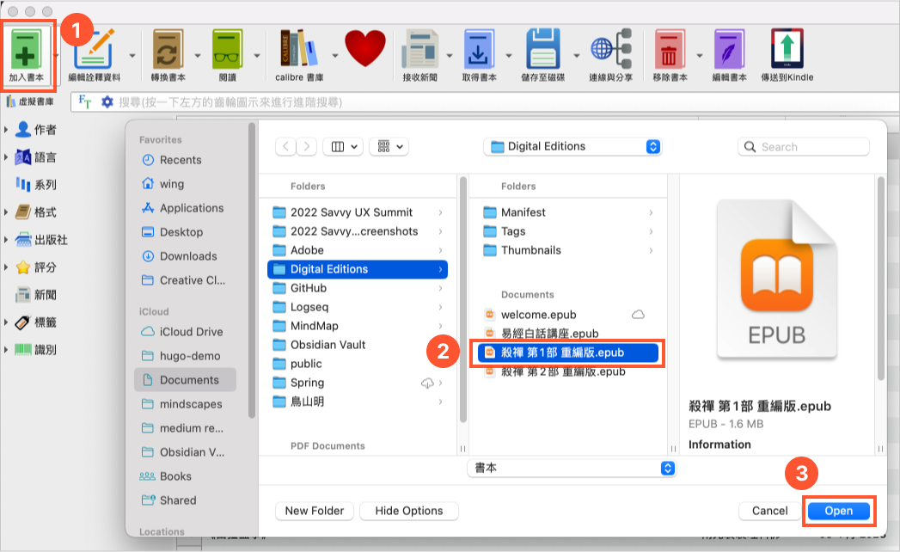

可以看到已經被破解的電子書出現在 Calibre 裏面了！大功告成！

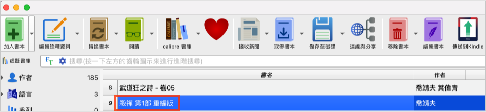