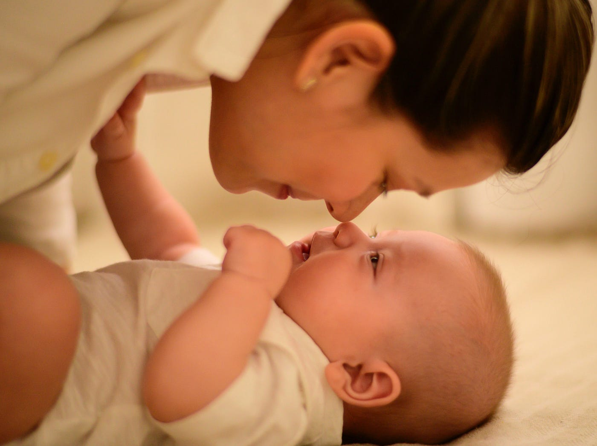

## 這本書在說什麼
首先，這本書的書名真的是誤導很多人，瞬間讓自己的讀者群減少一半，這本書其實適合所有「想擁有長期伴侶關係」的人，不論是單身想脫單，或是已經有伴侶又想維持良好的長期關係，都非常適合從這本書找答案。

以下會把這本書拆解成三個部分，第一個是先了解自己看待感情的心態，第二個是判斷長期關係的特質，最後，同居和結婚對自己的意義是什麼。

現代交友遇到其中一個最大的困境，就是缺乏感情榜樣。今天假如自己的家庭爸媽感情很好在一起幾十年，較容易想像長久關係會是什麼樣子，但假如從小缺乏感情榜樣，這時候就只能憑空猜測或是根據一些虛假的社群媒體，電影電視劇也只會把精彩片段演給你看，但怎麼可能每天都活得像偶像劇？

書裡有一個小測驗，可以測自己是三大感情心態的哪一種？（沒有測也沒關係，可以直接看看自己是不是這樣的人。）

## 三大感情心態你是哪一種？
### 1. 浪漫派
對於現實生活會有童話故事般的想像，這種人有以下特徵：

- 覺得自己總有一定會遇到一個白馬王子/公主。現實是：但這個世界上是不會有完美的人。
- 或是覺得只要找到白馬王子/公主從此就會幸福快樂。現實是：任何感情都是需要努力經營。
- 被浪漫喜劇的美麗邂逅洗腦，期待有一天會不小心天上掉下來一個對象，現在只是還沒有遇到也不想做任何努力。現實是：努力創造機會，不要痴傻等待。
- 現在社群媒體很多放閃的照片，讓人對於感情有不切實際的想像，但是現實是，誰會把吵架的照片放上來？
### 2. 完美派
完美派的人希望可以探索所有選項之後再做決定，交往的時候會一直想，或許下一個會更適合自己，但有研究顯示，滿足派的人會比較快樂對於現在的交往關係滿意度也比較高。

### 3. 猶豫派
猶豫派的人一直覺得要把自己身心靈都準備好了才要投入一段感情，可能是希望學業或事業有成再開啟一段關係，但實際上卻錯失很多學習的機會。

## 了解自己的依附型態

## 依附理論 (Attachment Theory)

依附理論源自於發展心理學家約翰．鮑比（John Bowlby）的研究。鮑比認為小孩子有依附母親的天性。後來，心理學家瑪莉．安斯沃思（Mary Ainsworth）透過一項試驗研究依附類型是否因人而異。這項實驗現在很有名，叫做「陌生情境」（strange situation）。安斯沃思把母親跟嬰兒（十二至十八個月大）放在一個有玩具的房間，媽媽離開房間以後再回來，把小孩對於媽媽**離開**和**回來後**的反應分成了三種。

1. 媽媽離開以後開始焦慮，等母親回來以後，會暫時安定停止哭泣，再發脾氣把母親推開 ，這種是**焦慮型依附** (Anxiously Attached)
2. 第二種是媽媽不在就開始哭鬧，等媽媽回來以後就停止哭泣，開始玩玩具，這種是**安全型依附** (Securely Attached)
3. 這類型的小孩媽媽離開以後沒什麼反應，回來也沒什麼反應，但研究人員有發現其實他們的心跳加速和焦慮的反應，但假裝不在乎，從外表看起看起來很平靜，這種類型是**逃避型依附** (Avoidantly Attached)

依附理論是一個廣受使用的框架，能解釋我們為什麼喜歡某類型的人，為什麼過去的感情關係沒有結果，為什麼我們受到某些壞習慣的殘害。研究人員發現這個理論，**同樣適用於成人的依附類型**──能解釋我們依附在哪種類型的人、與他們的互動模式、以及許多感情關係好壞的原因。

****焦慮型依附者**成年後害怕被拋棄，需要隨時隨地需要和伴侶保持聯繫，害怕孤獨，經常運用各種行為獲得伴侶的關注，他們可能會一直打電話、傳訊息，威脅說要分手好讓對方吃醋，或是透過掛電話和不接電話來傳達某種想法。

至於看到母親離去，就算內心徬徨但又裝作冷漠的**逃避型嬰兒**，他們覺得自己不能依賴照顧者，因為照顧者只能滿足他們部分需求。長大以後就會假裝不想與人連結，來降低被拒絕所產生的痛苦。如果關係變得親近，他們就會遠離，這種遠離的行為叫做「疏離戰術」。假如你有聽過對方說：「我還沒做好進入這關係的準備」、「我工作很忙現在無法和你交往」，這就是逃避依附行的行為。

**安全型依附**的嬰兒相信母親可以滿足他們的需求。安全型依附者是理想伴侶，個性可靠又可信，不太會有情緒化的鬧劇，寬宏大量、善於溝通。行為穩定能建立健康的界線，能與人親密。根據研究，安全型依附者對感情關係的滿意度，高於逃避型或焦慮型的人。

其實全世界 50% 的人屬於安全型依附，乍聽是好消息，但問題在於雖然安全型依附者佔總人口 50％，但他們佔單身人口的比例很少，因為這類型的人很快就被搶走了，另一方面也是因為他們善於建立健康的感情關係，所以通常能交往長久。因此，單身人口就充滿焦慮型和逃避的人XDDDD

---

書中有提到一個練習，可以辨認自己的依附型態：

1. 對於親近別人和親密程度，你感到自在嗎？你會避免與人親近嗎？程度如何？
2. 對於伴侶是否愛你、是否對你有興趣，你感到多焦慮？你是否常常擔心自己的感情關係？

說明：
若你渴望與人親近，但卻對感情關係的未來感到不安，擔心伴侶對你沒興趣，你可能屬於焦慮型依附。若你和人太過親近時，會感到不自在，而且重視自由大於兩人相處，你可能屬於逃避型依附。若你對於親密或獨處都感到自在，而且不常擔心自己的感情狀況，你可能屬於安全型依附。

---

## 判斷長期關係的特質

**重要但….沒那麼重要的**

### 1. 金錢
金錢很重要沒錯，如果兩人生活很貧窮無法維持生活所需，不快樂程度也會很高。財務困難也會對婚姻造成壓力，金錢充裕的情侶不用面對各種困難的財務抉擇，不用思考要可不可以幫老大作牙齒矯正，還是要不要讓老么請家教。哈佛大學商學院研究發現，有能力外包煮菜清潔等耗時家事的情侶，對感情滿意度比較高，因為他們有時間陪伴彼此。

但這不代表人應該為了幸福而追求**最富裕**的伴侶。過了某個界線，金錢就無法在讓人產生快樂。因為我們會適應自己所處的狀況，不論事情有多美好，新奇感中就會慢慢消失，讓我們不在注意這件事。

所以金錢很重要，但影響有限，當在思考感情的未來時，考量金錢是對的，但不需要當成第一因素。

### 2. 外貌

跟長得好看的人結婚，有一天也會習慣對方的長相，作者有一段有趣的話：「美一位俊男美女的背後，都有一個厭倦和他們做愛的人。」熱戀和性慾總有一天會衰退，重點是，對方是否有其他地方吸引你，而不是去找最性感最好看的對象。

### 3. 和自己個性相似

很多人會假設，個性越相似，相處過程會越容易。但這個假設錯誤。研究發現，個性是否相似和長期關係幸不幸福，沒有關聯。

問題在於，你會想和自己交往嗎？我是不會拉！

努力去欣賞伴侶跟你不一樣的地方，而不是要把對方變得更像自己比較可以長久。

### 4. 共同興趣

共同興趣其實沒有大家想得這麼重要，關鍵在於，興趣不同沒關係，只要在追求興趣的同時，也能位關係做出貢獻就好。如果你很喜歡喝葡萄酒，但伴侶不在乎這點，你也沒必要找一個侍酒師結婚。重點在你快樂的去 Napa 酒莊品酒，對方不會造成你的罪惡感，也不會問「你為什麼一直在喝酒」這種話。

良好的感情關係可以容得下個性不同、興趣不同的人，只要互相給予空間自由，各自探索自己得興趣，雙方就能享受不同的活動。伴侶是無法扮演所有角色的，對方和你興趣不完全相同，不代表他們不適合你。對於伴侶無法扮演的角色，請找朋友或家人填補，長期而言，你會變得比較快樂。

## 比你想得還重要的特質

### 1. 情緒穩定、心地善良
心理學家泰．田代在著作《從此幸福快樂的愛情真相》中分析關於擇偶條件的既有研究，發現情緒穩定和心地善良是兩個最重要，但卻最不受重視的特質。心地善良和情緒穩定的人會關懷、同情他們的伴侶。而「關懷和同情」是成功的長期關係關鍵。

假如想判斷對方是否善良，請注意他們如何對待沒有利害關係的人，像是餐廳服務生，對朋友和父母有同理心嗎？

想判對對方是否情緒穩定，可以注意他們如何面對高壓環境。是會驚慌失措還是鎮定處理？面對各種情境的方式，是判斷伴侶情緒穩不穩定的指標。

### 2. 忠誠心

要找一個能同甘共苦的伴侶，有忠誠心是關鍵。不論你是在贏得大獎或是進了癌症病房，都會陪伴你的人。

有一個簡單的方法可以評估對方的忠誠度，就是看看他是否擁有長期友誼。

### 3. 成長型思維

具有成長型思維的人，更有可能會花心思改善感情關係，而不是假設問題無法解決，最後放棄離開。

### 4. 能引發出你最好的一面

到最後，感情關係的重點不是兩個人各自的個性，而是兩個人在一起的結果。對方可以引發出你什麼樣的性格？他的善良是否讓你覺得自在，感到被關懷？還是因為對方焦慮，使你感到焦慮？了解對方引發出你什麼樣的特質，因為兩個人相處的時候，你就會成為這樣的人。

可以問問自己，和對方相處當下，或剛相處完畢，你有什麼感覺？感到有精神？感到洩氣？感到無聊？覺得被挑戰？覺得快樂？覺得自己很聰明？覺得自己很笨？請選擇能把你最好的一面帶出來的對象。

### 5. 處理爭執的能力

爭執是處理問題的機會，也可以避免雙方累積怨恨。目標不是找到一個不會起爭執的伴侶，而是找到一個**善於處理爭執**，不會令你擔心吵架後會結束關係的伴侶。處理爭執的第二步，在於和好。成功的情侶可以靠著講笑話、退讓或告訴對方他們欣賞對方的地方來打破吵架時的緊張氣氛。

## 重視同居、結婚所代表的意義
向對方明確定義關係後才往下走

### 「決定」或「滑行」

情侶進入下一階段關係的方式，心理學家把這分為兩種：「決定」和「滑行」。**「決定」**指的是對雙方關係的轉型，刻意做下決定，例如決定一對一交往或決定生小孩。**「滑行」**指的是沒仔細思考就滑入下一階段。兩者之間差異很大。以「決定」的方式進入下一階段的情侶，通常會有更健康的關係。

此外，路易斯維爾大學（University of Louisville）和丹佛大學（University of Denver）的研究人員，發現「滑行」過關係里程碑的人，對伴侶的專一程度較低，而且比較容易發生婚外情。這些研究證明，「滑過」決策點會對關係造成危害。

### 「定義關係」是重要的決策點

定義關係為什麼重要？有的人可能約會中，和對方做了情侶會做的事，甚至和對方父母見過面，就以為已經是男女朋友關係，也從來沒有和對方明確討論過彼此的關係，最後發現自己一廂情願，對方根本不覺得兩個人已經進入一對一個關係，浪費自己的時間。

定義關係是非常重要的決策點，是討論兩人關係進度和關係方向的機會。如果對方不把認真的你當作潛在伴侶，難道你不想早點知道這件事？為了獲得正確選擇所需要的資訊，你必須清楚定義關係。

### 同居也是重要的決策點

同居前判斷自己的狀況是「決定」要同居還是「滑入」同居狀態。很多情侶是為了方便或是省房租而同居，但同居會大幅提升分手的成本，令人很難誠實看待兩人關係的品質。如果兩人同居後發現關係不順，此時兩人繼續在一起的機率，會高於各自有個人空間的情侶。

「決定」同居的情侶中，有四二％享受幸福的婚姻，而「滑入」同居的情侶，只有二八％婚姻幸福。有時，兩人對同居的意義有完全不同的看法，但如果沒經過這種對話，情侶可能一直沒發現兩人看法不一，直到簽了租約才發現為時已晚。

---

### 練習：簽訂租約前，先達成共識

同居前，請空出一個週末回答以下問題：  
一、兩人為何要同居？  
二、同居對你的意義為何？   
三、你對這段關係有什麼期待？  
四、兩人有沒有考慮結婚？如果有，預計何時結婚？  
五、你對同居有什麼恐懼？

---

選擇同居會提升兩人**「滑入」**婚姻的機率，所以一定要仔細看待此事，並討論這對兩人未來的意義。

## 該留下或離開？

太早分手的人，不知道如何維持關係，而太晚分手的人，則不知道如何斬斷關係。當你和一個人已經在一起好一段時間，苦於不確定該不該分手的時候，**「衣櫥測試」**可以協助你，決定到底要終結關係，還是修補關係。

**衣櫥測試：如果現任伴侶是你衣櫥裡的一件衣著，他會是哪一件？**  
**詮釋答案：** 藉由答案，了解你對伴侶和兩人關係的看法。如上所說，此題很抽象，有助於揭露兩人關係背後的真相。詮釋答案時，必須分析自身心態。大致上來說，答案如果是毛衣、夾克等保暖用的外出服，或是最喜愛的襯衫、褲子或鞋子，那就是好徵兆。答案若是破舊、會讓人癢或不舒服的衣著等不會想穿出門的衣服，就不是好的。

## 決定進入婚姻前的準備
決定走上紅毯前，你可以做 **「過去、現在、未來」** 的功課。這是一系列的自我反思和兩人對話，你們應該要討論過去（兩人從前的經歷）、現在（兩人現在的狀態）和未來（兩人未來的走向）。

這是一系列的正經對話，請騰出三個晚上到一個月的時間，別全部塞在一個晚上！談話時，請保持好奇心，探索伴侶的目標，思考這些目標有沒有和你的相符。記得，這樣做是為了避免假共識效應。

---

**練習：回答有關兩人關係的問題**
 
這個練習有三組談話，請一個晚上進行一組。我建議先和伴侶一起從事某種活動，用來建立連結感。心理治療師艾絲特·沛瑞爾發現，我們欣賞伴侶的個人才華時，對伴侶的愛意特別濃厚註1。你可以互相教對方一個新技能，用來提升愛意。如果其中一人是烹飪高手，何不教對方做一道新的菜餚？
對話氛圍要浪漫，畢竟你們要討論結婚的事情，世上最浪漫的事莫過於這個吧？請安排環境，穿著適當。請拿出收藏的葡萄酒，準備山姆·庫克（Sam Cook）的曲子，依偎著伴侶，問他以下問題。
 
**對話一：過去**  
- 嘗試列出三項你覺得哪些過往事件定義了你這個人？
- 你覺得你的童年經驗怎樣影響你現在的為人？
- 你的父母以前會吵架嗎？你對感情關係裡的爭執有什麼恐懼？
- 你的原生家庭是不是有某些傳統，讓你想帶到我們的家庭裡？
- 小時候，你的原生家庭會如何討論性愛（或是缺乏討論）？
- 在你的原生家庭裡，金錢代表什麼？
- 你的原生家庭是不是有某些包袱，讓你想留在過去？
 
**對話二：現在**
- 遇到事情時，你可以放心和我討論嗎？
- 你覺得我們現在的溝通模式，有沒有需要改善的地方？
- 在這段關係裡，你覺得你可以做自己嗎？原因是什麼？
- 你覺得我們的關係中，有什麼需要改變的地方？
- 你覺得你處理爭執的能力如何？
- 你最喜歡我們兩人做的什麼儀式？
- 你希望我們兩人能多做些什麼事？
- 你覺得我對你親朋好友的了解程度有多少？你會希望我多認識你身邊的某個人（家人、朋友、同事）嗎？
- 你理想的性愛頻率為何？我們的性生活如何變得更好？我有哪裡需要改善？你有沒有一直想要嘗試，但卻害怕說出來的事情？
- 你多久會想一次有關錢的事？
- 坦白討論兩人的財務狀況吧。你有學貸嗎？卡債？你會幫我一起償還債務嗎？
- 買車的預算上限是多少？沙發呢？一雙鞋呢？
 
**對話三：未來**
- 你未來想住哪裡？
- 你想養小孩嗎？如果想的話，要生多少個？何時生小孩？如果我們不孕，還可以考慮哪些方式？領養？代理孕母？
- 你覺得要如何分工照顧孩子和家事？
- 你想多久一次與家人見面？
- 你希望宗教信仰在我們生活裡扮演什麼角色？
- 你想討論婚前協議嗎？你對這個有什麼恐懼？
- 你希望未來財務怎樣分配？
- 你覺得你會一直工作嗎？如果我們其中一方想休息一段時間，會發生什麼事？
- 如果我想買高價的東西，在什麼情況下必須先找你討論？（例如，我可以自行決定購買的金額上限是多少？）“•你的長期財務目標是什麼？
- 你對未來最期待的是什麼？
- 你對未來有什麼夢想？我可以如何幫你一起實現這個夢想？

---

## 這本書對我的影響
對於很多感情的觀念，以前好像似懂非懂，都是要靠在每一次的跌倒中摸索，而對於感情的追求方式，都是仰賴直覺居多，但書裡很明確地點出正確的觀念和你現在做的選擇會怎麼樣明確影響到未來的生活，譬如一個人最重要的兩個特質，善良和情緒穩定，這是很多人都不會注意到的事實，而這樣的特質的確長期會給兩人的關係帶來深遠的影響。書中除了佐證之外，也舉了很多生活化的例子像看故事書一樣，推薦每一個尚未踏入，或正在一段感情中的人閱讀。
