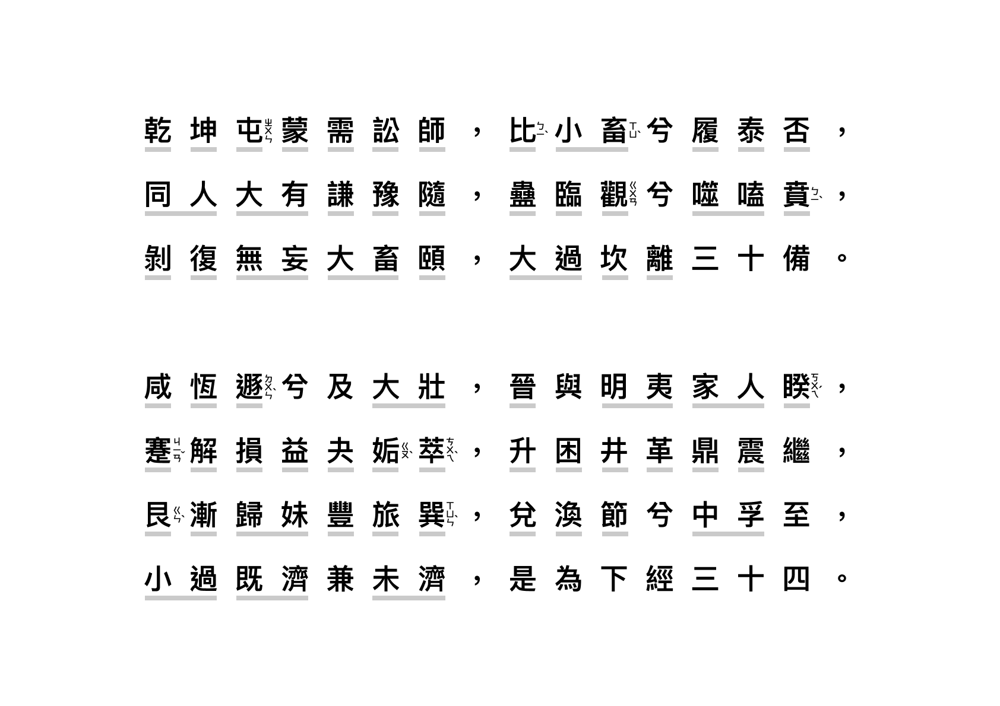
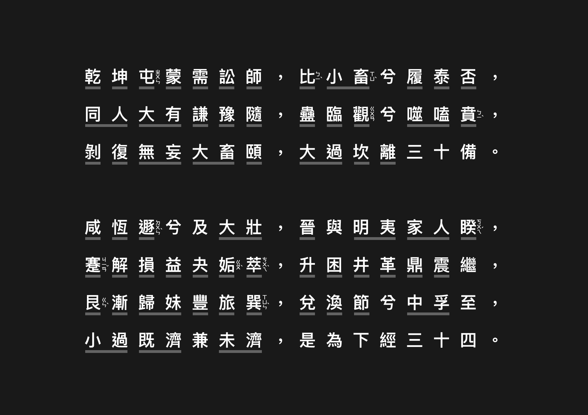

今年開始接觸易經，學習了幾個月，上網一直找不到喜歡的《卦序歌》，所以乾脆自己設計排版，也分享給需要的人。卦名有用灰色底線標示，也加上容易誤念的注音。

> **《易經卦序歌》**
>
> 乾坤屯蒙需訟師，比小畜兮履泰否；
> 
> 同人大有謙豫隨，蠱臨觀兮噬嗑賁；
> 
> 剝復無妄大畜頤，大過坎離三十備。
> 
> 咸恆遯兮及大壯，晉與明夷家人睽；
> 
> 蹇解損益夬姤萃，升困井革鼎震繼；
> 
> 艮漸歸妹豐旅巽，兌渙節兮中孚至；
> 
> 小過既濟兼未濟，是為下經三十四。
> 
*出處：南宋理學家朱熹《周易本義〈卦名次序歌〉》*

---

- [《卦序歌》Light Mode 下載](https://mindscapes.wingster.cc/posts/IChing-Hexagram/IChing-Hexagram-Song-LightMode.png)

- [《卦序歌》Dark Mode 下載](https://mindscapes.wingster.cc/posts/IChing-Hexagram/IChing-Hexagram-Song-DarkMode.png)

---

關於讀音的部分：

**比卦的比**

有的人說念ㄅㄧˇ，我這裡用ㄅㄧˋ。
主要是參考傅佩榮教授《樂天知命》有特別標示比(ㄅㄧˋ)的注音，另外在吳耀輝《周易古占筮法》裡有寫比為親信、親密之意，剛好和[教育部重編國語辭典修訂版](https://dict.revised.moe.edu.tw/dictView.jsp?ID=331&q=1&word=%E6%AF%94#order2) 裡念法為比ㄅㄧˋ的解釋相同，故採ㄅㄧˋ。

**夬卦的夬應該念ㄍㄨㄞˋ或是ㄐㄩㄝˊ？**

以目前教育部標準國語字典或是打字的時候，要打ㄍㄨㄞˋ字才跑得出來，傅佩榮教授書裡也是寫ㄍㄨㄞˋ。但在王思迅老師《易經白話講座》和吳耀輝《周易古占筮法》裡有提到，夬為玦得本字（可參考[甲骨密碼](http://www.jiagumm.com/html/jiaguwenzidian_4518.html)）以夬在易經裡的解釋，念ㄐㄩㄝˊ會比較正確。所以這裡我就不特別標示，端看個人喜好解讀。

