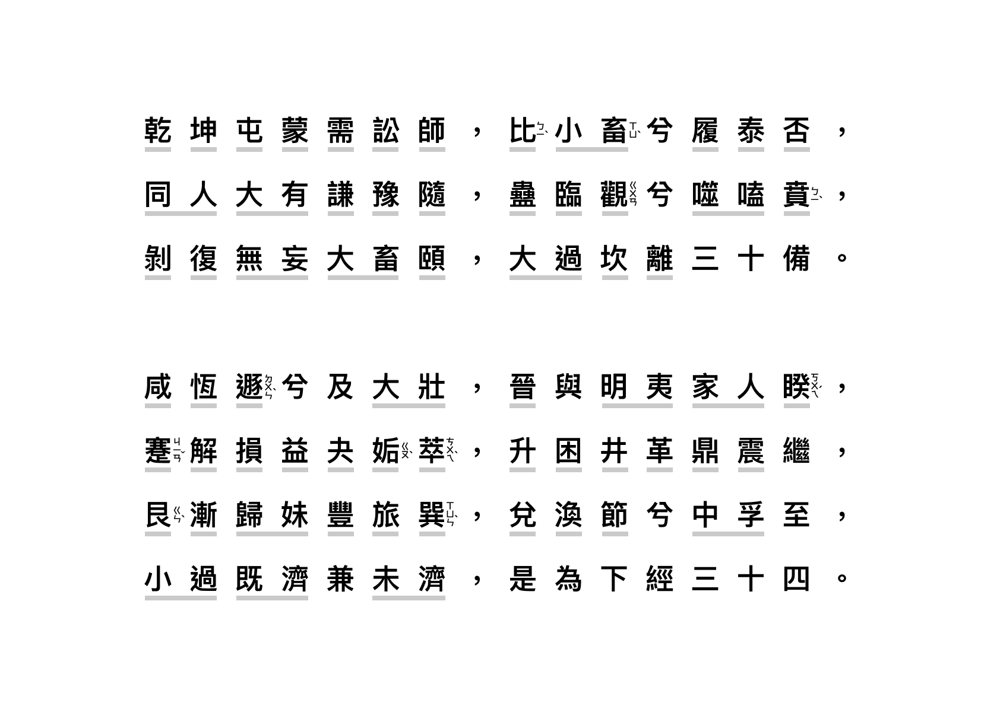
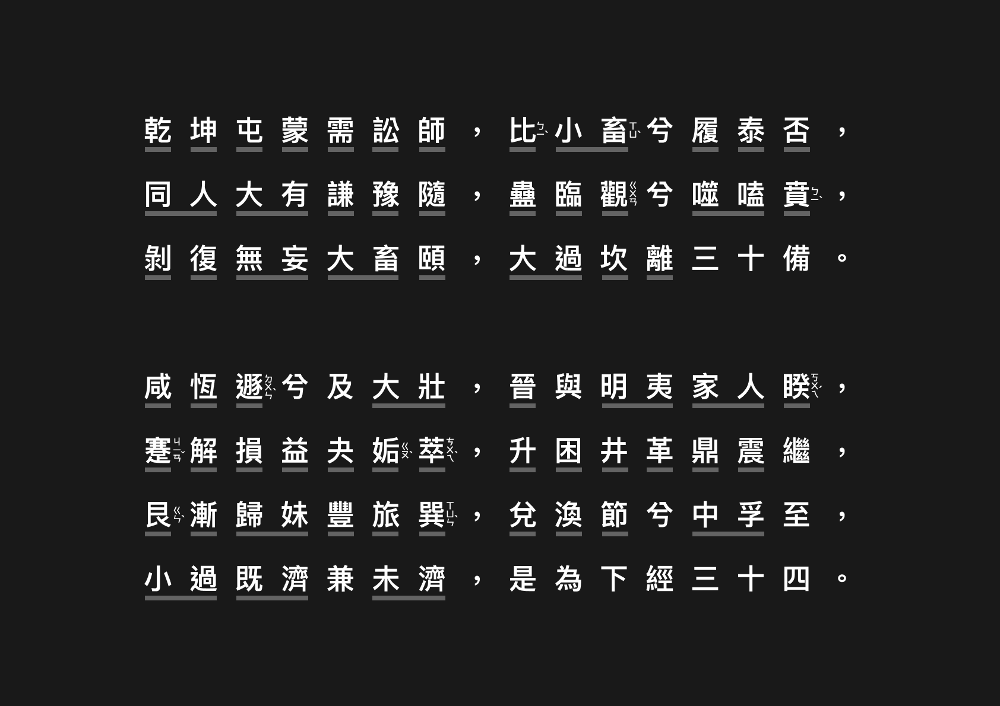

今年開始接觸易經，學習了幾個月，上網一直找不到喜歡的《卦序歌》，所以乾脆自己設計排版，也分享給需要的人。卦名有用灰色底線標示，也加上容易誤念的注音。

> **《易經卦序歌》**
>
> 乾坤屯蒙需訟師，比小畜兮履泰否；
> 
> 同人大有謙豫隨，蠱臨觀兮噬嗑賁；
> 
> 剝復無妄大畜頤，大過坎離三十備。
> 
> 咸恆遯兮及大壯，晉與明夷家人睽；
> 
> 蹇解損益夬姤萃，升困井革鼎震繼；
> 
> 艮漸歸妹豐旅巽，兌渙節兮中孚至；
> 
> 小過既濟兼未濟，是為下經三十四。
> 
*出處：南宋理學家朱熹《周易本義〈卦名次序歌〉》*

---

- [《卦序歌》Light Mode 下載](https://mindscapes.wingster.cc/posts/IChing-Hexagram/IChing-Hexagram-Song-LightMode.png)

- [《卦序歌》Dark Mode 下載](https://mindscapes.wingster.cc/posts/IChing-Hexagram/IChing-Hexagram-Song-DarkMode.png)

