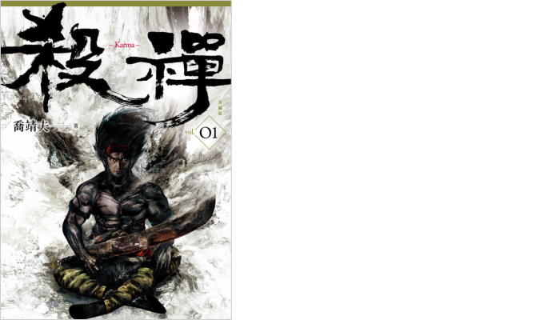
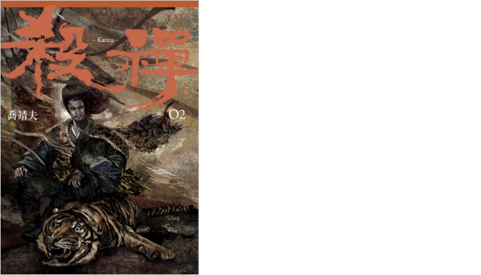

在其他小說和電影中，常常能見到一位角色堅守道德底線，不願逾越限制，我們透過他們的眼睛看世界，見證他們如何克服逆境。然而，在《殺禪》的世界裡，每個人都淪陷於自身慾望的掌控之下。這裡沒有所謂的「好人」，每個角色都被慾望所囚禁，在黑暗中徘徊。

以下有雷

.
.
.
.
.

故事主要在講六個逃兵，如何相遇、結拜成為兄弟，在大哥于潤生的帶領下，闖蕩江湖黑道，爭權奪利。

老大于潤生瘦瘦白白高高，是個聰明且知道如何煽動人心的人。他從一開始就在物色適合幫助自己實現夢想的夥伴，然後結交這些人成為拜把兄弟。在領導方面，他善於利用資源，了解如何將適合的人放在適合的位置上。

老二龍拜是一位神射手，可以在半里之外用箭精準射死敵隊將領的腦袋。雖然眼力很好，但在識人方面不及老六白豆，因此當白豆被賦予指揮和招募工作時，他心裡其實有些不平衡。

老三葛元昇是一位啞巴，是裡面殺人技術最強的人。但他的殺氣重到已經入魔的程度，開始對虐殺人上癮，不分男女老幼。在戰爭時期，這樣的人很好用，但在太平盛世時，如何處置這樣的人也成為了老大于潤生的一大難題和隱憂。

老四齊楚一開始看起來最無用，武功不強，性格軟弱。但老大于潤生和老六狄斌發現他的長處在於頭腦和記憶力很好。例如在大戰時，他能夠記住整個城鎮的巷弄地圖，或者處理記帳等事務，頭腦僅次於老大。因此，他被放在策略的位置上。

老五鐮首，過去曾是個和尚，因為某些事情被逐出也遺忘了記憶，有驚人的力量，是個高壯漢子，男女都莫名被他吸引，但他常會思考人生的意義，也想找回自己的記憶。他的武力有被好好利用，但老大也常不知道他腦袋在想什麼。

老六狄斌是個矮小的漢子，他不是武功最強的，也不是膽子最大的，但他的共感能力很強，也是大家關係的潤滑劑，懂得識人用人，所以被老大派去招募新成員和總指揮，老二因此很吃味。

看老大于潤生如何從一無所有，如何運用每個兄弟的專長來達到他的目的，會很佩服他的領導才能。

老大于潤生和他的六位結義兄弟，背景各異，但都具備軍人背景和專業技能。從一無所有的狀態進入漂城，他的選擇不是馬上大手大腳地展開行動，而是找了份藥房小販的工作。同時，他告誡其他兄弟不要加入黑道，避免惹事，各自尋找正當的生計。這主要是因為漂城裡存在兩大黑社會集團，分別是「屠房」和「豐義隆」。

于潤生的聰明之處在於，他知曉在進入新環境、新產業之前，掌握資訊的重要性。他花了一兩年的時間，深入了解這兩個集團的背景、主要幹部的性格、喜好、習性等等。當他掌握了詳盡的資訊後，才施展各種策略，確保自己的權力和利益得以最大化。

相較於現代職場，如果一進入新公司就急於革新、破壞舊規矩，而不先了解目前公司為何運行，儘管一些現行規則看似不合理，最終往往會陷入失敗、黯然離開的局面。

在《殺禪》中，幾乎每個角色都深陷於自身的慾望中，不論是為了金錢、權力、女色或是個人私慾，甚至包括被視為最具人性的老六白豆，為了實現兄弟的夢想，也不惜殺人放火，害死了眾多無辜的貧民。

我一直對於老大于潤生背後推動他的力量感到好奇。他為了得到所渴望的東西，竟然可以殺掉對他如親生子般愛護，並準備將未來領袖之位傳給他的黑道大佬，甚至連自己未出生的兒子也能犧牲。他更私下派遣老五去執行任務，趁著老五出差，指使與老五相愛的女人去色誘他人，只為達成自己的目的。

于潤生終於在京都取得地位，然而，當他以為勝券在握時，卻被更高層次的人狠狠打擊，一夜之間，他的計謀化為烏有。第三集的中段雖然稍顯平淡，但最終，老四齊楚，這位一直被認為溫文爾雅、書生氣的人，也在慾望面前屈服，帶來了整本書的高潮。

最終，于潤生真的實現了大逆轉，登上權力之巔。然而，他的人性也在這過程中逐漸喪失。

對於後面登場的人物，我感到非常可憐無力。幾乎每一個人都身不由己、下場淒慘。

五哥鎌首看到社會的不公不義和貧富懸殊，召集農民和窮人起義，最後率領四十萬大軍幾近勝利，卻發現他所佔領的地區，仍然受到剝削和貪污。最後心灰意冷，投降後遭受酷刑，死於非命。他明明是想做好事，卻未能善用自己的力量和領導魅力，更加未能有效管理龐大組織、正確傳遞、行銷他的理念，導致整個樓歪掉。

老六白豆意外殺了自己養育多年的黑子，而且黑子還是他深愛的五哥的小孩。為了心中那段過去美好的兄弟情誼，他不敢做出改變，也不敢追求自己的幸福。他認為，拼命維持現狀就能保留以前美好的回憶。老六一輩子忠誠無悔，對每一個兄弟都付出最多感情，最終也因心灰意冷而走上刺殺他一輩子尊敬的老大于潤生的道路。

最後，這部小說中的角色眾多，命運多舛，他們中的許多人最終都走向了悲劇的結局。雖然最後一集讀來感覺沉重，但這部作品深刻地反映了作者年輕時對於社會現況的洞察和思考。與《武道狂之詩》所傳達的正面能量相比，《殺禪》則展現了更加真實、殘酷的人性，讓人不得不深入思索人性的複雜性和社會的無奈。