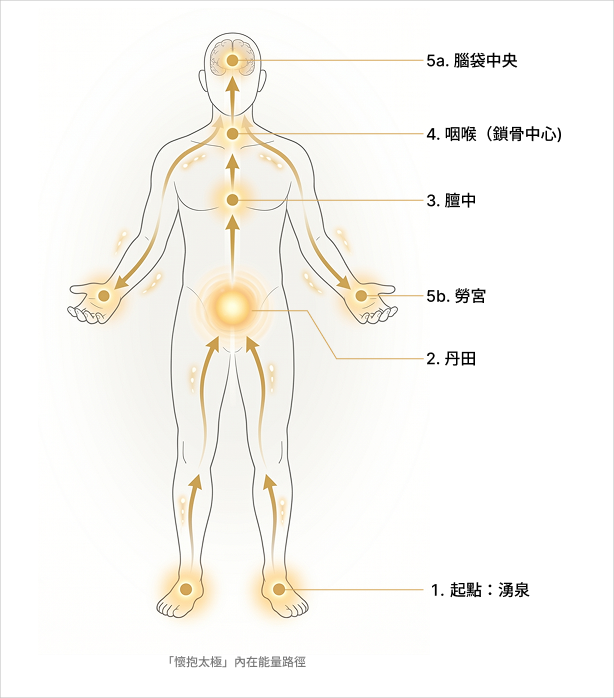

不知不覺學習太極拳竟然超過一年了，常常在和教練學習的時候，卻還是像剛學一樣（？） 剛開始只想趕快把套路記熟，不要忘記動作就謝天謝地了。現在想花更多心力在身體內在外在的細節變化。所以開始整理了一些上課和影片學習筆記，關於太極拳的內在功法鍛鍊重點，文章末尾附上教學影片。

### 1\. 太極拳不犯「雙重」，雙重是什麼？

剛開始我一直以為雙重是不能把重心平均分散在兩腳，重心要很明確的轉換，結果只對了一半。雙重的「雙」，並不是二個的意思，古人形容只要是「一以外」的，都叫「雙」。

這裏並不是說不能兩腳站立，而是必須有一個準確的重心點。譬如進入太極拳平立的時候，即使雙腳著地，意識中的重心必須很精確。平立時，這個點就在丹田。

### 2\. 修習「止觀」的參考書：太乙金華宗旨

教練提到的[這本書](https://books.google.com.tw/books?id=Kt7qDwAAQBAJ&amp;printsec=frontcover&amp;source=gbs_atb&amp;redir_esc=y#v=onepage&amp;q&amp;f=false)（榮格也曾為其寫過評述），是連結「內功」與「意識修煉」的橋樑。

* **為什麼這重要：** 太極拳不僅是武術，更是動態的禪修。教練提到「止觀」，暗示除了在拳路中，我們需要具備觀察自己念頭與身體細微變化的能力。
* **未來計畫：** 想將這本書列入我的「讀書清單」。內功是身體的實踐，而《太乙金華宗旨》可能是這套實踐的底層理論。

### 3\. 如何「懷抱太極」？

* **懷抱太極內在能量路徑**（下圖）：

太極拳進入平立以後，從湧泉經過丹田、膻中、到咽喉（鎖骨的中間）然後一分為二，一是往勞宮穴，另一是往腦袋中央頂門的位置，然後利用「攤」起來的感覺讓手**浮**上去，浮到手很重的時候在降落下來，然後就完成了懷抱太極。

* **注意事項：**

要自然的感覺去感受，非強硬帶動，不要用幻想的。

