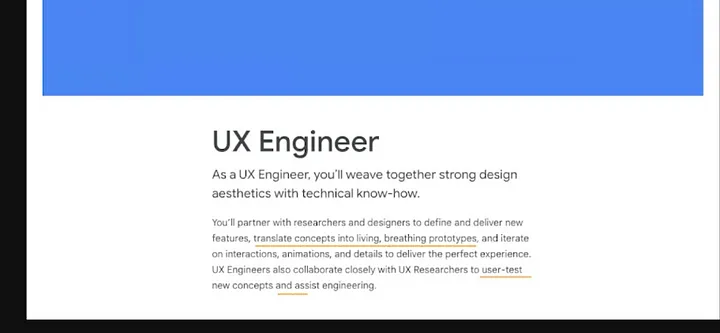

## 前言
最近聽了 SAVVY UX SUMMIT 2022 其中一位講者 Siva Ranjan 演講的主題 「Adios Figma, Hola JavaScript! My journey from being a UX designer to a front-end engineer」，主要在介紹 UX Engineer (以下簡稱 UXE) 這個新興的職業，以及他從設計師轉換到 UXE 的心路歷程。

因為自己本身是設計師背景，所以對這個主題蠻好奇的，也希望可以提供給設計師們多一個職涯規劃的選項。

下面記錄了這次演講的心得和重點，對於想認識 UXE 這個職業，還有身為設計師到底該不該去學 coding 會有一些不一樣想法。

附註：Siva 本身目前在 Netflix 任職約一年，之前在 Microsoft 原本是當 UX Designer，後來花了一兩年自學 HTML/CSS 和 Javascript，然後開始在公司做一些需要 coding 的小專案，四年後正式轉職到 UXE 的職位（毅力驚人）。

## Takeaway
1. 什麼是 UXE？
2. UXE 在幹嘛？
3. 你適合當 UXE 嗎？

***

### 免責聲明
在開始這個主題之前，Siva 有特別強調兩點：

> This is not a call to UXDs to start coding

這場演講並不是要鼓吹每個 UX Designer 都跑去寫 code，只是多提供一個職涯選項給喜歡 Coding 的人。

> UX Engineer ≠ UX Designer + UI Dev

UXE 並不是要你同時當設計師，又要同時當工程師，一個人當兩個人用，他有它特殊存在的意義，後面會在細說。

***

ＯＫ好，那開始進入主題：

## 什麼是 UXE？
舉例來說，軟體開發會有以下成員組成：（當然每個公司不一樣）

- UX/UXR
- UI
- Front end Dev
- Back end Dev
- Database Dev
- IT/DevOps
  
要是把以上成員分成兩類的話，UXE 這樣的角色是會落在前三個 UX/UXR, UI, Front end Dev 這個群組裡面，也就是說 UXE 其實和設計師、研究員和前端工程師會有較多的協作。那為什麼會需要 UXE 這樣的角色呢？

### 設計師和工程師使用不同的語言
譬如，設計師在講 Saturation (飽和度) 或 Kerning (字母間距) ，工程師聽到可能一頭霧水，當工程師在講 Caching (緩存)、*Cumulative layout shift (累計版面配置轉移) ，設計師應該也是黑人問號。

### 設計師和工程師有不同的優先序
設計師最在意 Let’s make it easy to use，使用者好不好操作，流程順不順，工程師最在意的是 Let’s make it and ship it，當兩邊目標不一樣，又沒有人跨出一步想去理解對方的時候，雙方人馬就會漸行漸遠，形同陌路。google_uxe_JD

這個時候，就會需要一個中間人出來打破僵局，出來當翻譯/協調者，也就是 UXE 出場的時候了！

但就我目前觀察到的職場現狀，通常擔任協調者的角色幾乎 PM 居多，PM 本身需要懂一些工程術語，或是真的有些厲害的工程師，會自己把專業術語翻譯成人類聽得懂的語言，給其他非工程背景的人理解。（目前有 UXE 這類職缺都是偏大型企業，猜測因為分工更細，所以有這種需求產生）

## UXE 在幹嘛？

上面是節錄 Google UX Engineer 的 JD，裡面提到：As a UX Engineer, you’ll weave together strong design aesthetics with technical know-how.

身為 UXE，會期待你同時擁有設計美感，和技術上的專業技能。工作上會需要和研究員/設計師合作，把新功能的概念想法轉換成更符合真實產品的 prototype。因為設計師用 figma 做 prototype，仍然以設計工具可以做到的程度在設計，但是 UXE 是**用 coding 在做 prototype**，不會有設計師做得出來但實際上產品做不出來的狀況發生，也就是更具有真實性。

這邊我覺得 Google 的 UXE, Mimin 寫了一篇[文章](https://medium.com/as-a-product-designer/google-%E7%9A%84-ux-engineer-%E4%BD%BF%E7%94%A8%E8%80%85%E7%B6%93%E9%A9%97%E5%B7%A5%E7%A8%8B%E5%B8%AB-%E5%9C%A8%E5%81%9A%E4%BB%80%E9%BA%BC-%E5%A6%82%E4%BD%95%E6%88%90%E7%82%BA-ux-engineer-96ef9e992263)裡舉了很好的例子：

今天團隊想開發一個新功能來做使用者測試，但是這功能需要後端工程師一個月的時間刻一個新的 API，同時這個功能很複雜，無法用單純的「按到底」的 prototype 給使用者測試，這個時候，登登登，UXE 就登場了，他們可以和研究員討論如何在沒有後端的情況，用程式做出高品質的 prototype 去驗證這個新功能的價值。

另外 Siva 還有提到其中一個工作內容，是重新設計一些公司內部系統、數據相關的 Dashboard 等等，像是他在 Netflix，使用者在觀看串流的時候，要是看到一半突然 crash，裝置會回傳 log 回去給 Netflix，他就可以負責把這些 data 做成 Dashboard 來觀測到底哪裡出了問題。也因為 UXE 具備 design sense 所以像這樣的專案不需要額外再花其他設計師的資源，UXE 可以直接完成。

接下來，就是問問自己，

## 你適合當 UXE 嗎？
從 Skill Stacking 的角度回答這這問題之前，我們先來聊聊什麼是 Skill Staking：

Skill Staking 是 Scott Adams 《呆伯特》漫畫作者提出的職涯建議：

>If you want to be extraordinary, you have two paths:
>
>1. Become the best at one specific thing.
>2. Become good (top 25%) at two or more things.
>
> - Scott Adams ([source](https://dilbertblog.typepad.com/the_dilbert_blog/2007/07/career-advice.html))

簡單來說，你想當人上人，要嘛就是成為某專業領域裡面最強的，不然就是成為兩個以上的專業領域的前 1/4 強，也就是兩個互補技能 > 一個專精技能。

Siva 另外舉了個很有趣的例子，互補的加乘效果為什麼比較大？你今天很會唱歌，同時又很會游泳，但是這兩個技能互補的用處不大。但要是你今天很會唱歌 ，同時又很會寫歌，那你在會寫歌又會唱歌的這個領域裡就是個佼佼者了！可以參考下面的圖：

如果你想成為某技能的 Top 1％，可能要努力到爆炸，擠到 Skill 1 or Skill 2 的紅色尖端。但假如，你今天還是很努力，但不用到爆炸的程度，成為 Skill 1 的 Top 10% 和 Skill 2 的 Top 10%，那你就可以成為世界上同時會這兩種技能的頂尖人物！

也就是說，你今天又會設計又會寫程式，對於你職涯一定是大加分，當然薪水也是另一個很大的誘因，大家應該都知道工程師的薪水普遍來說比設計師高，尤其是越 Senior 差距越大，看不到車尾燈那種（希望我可以早點知道這件事）。

但你也要問問自己以下幾個問題：

1. 不是每個人都適合寫程式，要是你無法真心喜歡寫 code，真的不用折磨自己。
2. 不是每個公司都有這樣的職位，也不是每個人都熟悉這樣的職位可以帶來什麼好處，你可能需要找機會讓大家發現理解你可以貢獻的地方。
3. 培養第二個專業技能需要花大量的心力和時間，要問自己是否願意投資下去。
假如你是設計師，對於如何寫程式把設計轉化成真實的產品很有興趣，那真的值得嘗試，假如你是工程師，對於如何設計互動，流程和介面的細節也很有興趣，那也很推薦嘗試。

希望這篇分享對大家的職涯規劃和好奇心有些幫助。